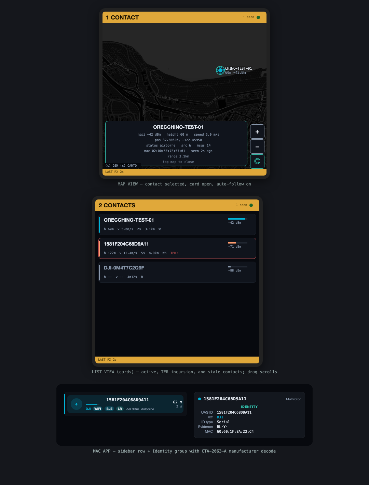

# Orecchino

Orecchino is a small ear for drone Remote ID. Most drones must broadcast
their identity and position using a standard called Remote ID (ASTM F3411 /
Open Drone ID). Orecchino listens for those broadcasts and puts them on a
map.

The project has three parts:

- A USB receiver stick, built on the Seeed XIAO ESP32-C3.
- A touch-screen console, built on the Seeed SenseCAP Indicator, that
  works on its own with no computer attached.
- A native macOS app that shows every drone and its operator on a live map.

```
 [drone]  ~~WiFi beacon / NAN / BLE~~>  [receiver]  --USB JSON-->  [Orecchino.app]
```

Orecchino only listens. It never transmits on any radio.


*Simulated data, rendered with the real UI code and map tiles.*

## How it works

Drones broadcast Remote ID over Wi-Fi and Bluetooth. The receiver listens
on every path at once: Wi-Fi beacons, Wi-Fi Aware (NAN), and Bluetooth LE —
including the long-range mode added in Bluetooth 5. Each decoded broadcast
is sent over USB as one line of JSON. The Mac app reads that stream and
draws it.

## USB receiver — `firmware/orecchino_fw`

Install the one library it needs, then build and flash:

```bash
arduino-cli lib install "NimBLE-Arduino"
```

```bash
arduino-cli compile -b esp32:esp32:XIAO_ESP32C3:PartitionScheme=huge_app firmware/orecchino_fw
arduino-cli upload  -b esp32:esp32:XIAO_ESP32C3:PartitionScheme=huge_app -p /dev/cu.usbmodemXXXX firmware/orecchino_fw
```

## Touch console — `firmware/orecchino_sensecap`

The SenseCAP Indicator (ESP32-S3 with a 4-inch, 480×480 touch screen) runs
the same radio core as the USB stick, plus a full drone console. It shows
contacts on an offline dark map. Drag to pan, pinch to zoom, and tap a
drone for its details. The side button switches between map and list views.
If a drone enters an active flight restriction, the console beeps and
flags it.

There is also a hidden extra: hold the side button for ten seconds to open
a live spectrum analyzer. It shows 2.4 GHz activity by Wi-Fi channel and
uses the LoRa radio to sweep 850–930 MHz. Tap the lower chart to zoom in;
the display re-scales itself as the signal picture changes.

Install the libraries, then build and flash with one script:

```bash
arduino-cli lib install "GFX Library for Arduino" PCA95x5 PNGdec
```

```bash
tools/flash_indicator.sh /dev/cu.usbserial-XXXX
```

Two things to know when flashing:

- The Indicator's USB-C port is a CH340 serial chip. Use the `usbserial`
  port, not the `usbmodem` one. If auto-reset fails, hold the green top
  button while plugging in USB.
- Flashing replaces Meshtastic on LoRa models. The Meshtastic web flasher
  can restore it.

The Mac app keeps the console's offline map tiles up to date over USB on
its own. To load tiles by hand instead:

```bash
python3 tools/fetch_tiles.py            # downloads into firmware/orecchino_sensecap/data
tools/pack_fs.sh /dev/cu.usbserial-XXXX # writes them to the device
```

Map data © OpenStreetMap contributors; tiles © CARTO.

## macOS app — `app/`

SwiftUI and MapKit, with no outside dependencies. It builds with the
Command Line Tools alone (macOS 14 or newer):

```bash
app/Scripts/make_app.sh     # produces app/build/Orecchino.app
open app/build/Orecchino.app
```

What it does:

- Live dark map with color-coded drones, heading arrows, flight trails,
  and operator positions
- Active FAA flight restrictions (TFRs) drawn on the map, refreshed every
  15 minutes
- A sidebar list and a detail card for each drone; missing data is shown
  as blank, never as fake zeros
- Flags a drone whose claimed operator position is more than 15 km away
- Finds the receiver's USB port by itself and reconnects after unplugs
- A demo mode with two simulated drones, so the UI can be tried with no
  hardware

## Data format

Each decoded broadcast is one JSON object per line:

```json
{"type":"rid","src":"ble","mac":"AA:BB:CC:DD:EE:FF","rssi":-61,"phy":"coded",
 "basic_id":[{"id_type":1,"ua_type":2,"uas_id":"1581F..."}],
 "loc":{"status":2,"lat":37.1234567,"lon":-122.1234567,"alt_geo":82.0,
        "alt_baro":80.5,"height":60.0,"height_ref":0,"speed":8.0,
        "vspeed":0.5,"dir":123,"ts":1801.2},
 "self_id":{"desc_type":0,"desc":"Survey"},
 "system":{"op_lat":37.12,"op_lon":-122.12,"op_alt":12.0,"op_loc_type":1,
           "area_count":1,"ts":238912345},
 "op_id":{"id_type":0,"id":"FIN87astrdge12k8"}}
```

Any device that speaks this format over a serial port can feed the app —
an SDR pipeline works just as well as the ESP32 receivers.

## Test beacon — `firmware/orecchino_tx`

A **test transmitter** for bench-checking a receiver without waiting for a
real drone overhead. Flashed to a spare XIAO ESP32-C3, it flies a synthetic
aircraft in a circle around a configurable home point and broadcasts it on
both paths a receiver decodes — WiFi beacon vendor IE on channel 6, and BLE
service data `0xFFFA` (BT5 extended when available, else BT4 legacy rotating
one message per advertisement).

**Each transmit path flies its own aircraft with its own identity**, so a
receiver's contact list doubles as a path checklist — a missing contact
names the path that isn't getting through:

| UAS ID | Path | Height |
| --- | --- | --- |
| `ORECCHINO-TEST-WIFI` | WiFi beacon, vendor IE, channel 6 | 60 m |
| `ORECCHINO-TEST-NAN` | WiFi NAN service discovery frame | 75 m |
| `ORECCHINO-TEST-BLE5` | BLE 5 extended advertising, 1M PHY | 90 m |
| `ORECCHINO-TEST-BLELR` | BLE 5 extended, coded PHY (long range) | 105 m |
| `ORECCHINO-TEST-BLE4` | BLE 4 legacy, one message per advertisement | 120 m |

The five orbit centres sit on a 200 m (~⅛ mile) ring around the home point
at 72° intervals, each at its own altitude, so the markers are clearly
separated on a map. Self ID and operator ID carry the path name too, and
each aircraft transmits from its own MAC / BLE address.

The ESP32-C3's BLE controller only grants two advertising sets, so the
three BLE flavours time-share them (1M keeps one set; coded and legacy
alternate on the other). Per-path transmit counters in the serial status
make a dead path obvious, and failures are reported rather than swallowed.

> This is test equipment, **not a compliant Remote ID transmitter**. The IDs
> are obviously synthetic by design so a stray capture can't be mistaken for
> a real aircraft. Mind local rules on what you transmit.

```bash
arduino-cli compile --jobs 2 -b esp32:esp32:XIAO_ESP32C3:PartitionScheme=huge_app firmware/orecchino_tx
arduino-cli upload  -b esp32:esp32:XIAO_ESP32C3:PartitionScheme=huge_app -p /dev/cu.usbmodemXXXX firmware/orecchino_tx
```

Serial control (115200, one command per line): `s` status, `go`/`stop`,
`e` toggle emergency status (exercises the alert path and the SenseCAP's
TFR/emergency banner), `h <lat> <lon>` move the home point, `r <metres>`
orbit radius. Status lines report per-path transmit counters and live
position. The encoder lives in `firmware/common/odid_build.h` and is
round-trip tested against the decoder in the suite below.

## Testing

```bash
tests/run_tests.sh
```

Both firmware targets share one Remote ID decoder
(`firmware/common/odid_decode.h`). It is tested on the host against real
over-the-air captures from the official OpenDroneID reference tools. App
tests cover the serial format, checksums, and tile math.

## License

GPL-3.0-or-later — see [LICENSE](LICENSE). Third-party components are
listed in [THIRD_PARTY.md](THIRD_PARTY.md); all are GPL-compatible. Map
tiles are fetched by the user and are not part of this repository.
